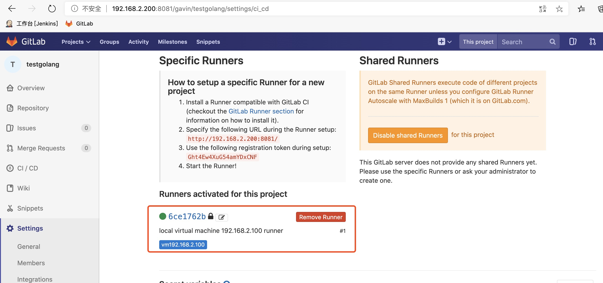

### gitlab-cicd   快速掌握并使用gitlab-ci工具快速代码编译、集成和发布

说明：本项目出处为如下地址。本人只是在此基础上修改和完善。
```
from https://github.com/yangshun2005/gitlab-cicd
```


[课程学习源码和文档](https://github.com/yangshun2005/gitlab-cicd)

[学习视频地址](https://www.bilibili.com/video/av92022124/)

### 一、项目概述

#### 1.准备工作

1.1. gitlab环境：代码仓库和编译器

1.2. 目标机：装有`docker`和`gitlab-runner`环境的服务器（Linux或类unix机器）

1.3. 项目代码：testgolang为例（gitlab官网仓库）

1.4. Dockerfile：对程序编译后打镜像

1.5. .gitlab-ci.yml ：CI/CD的gitlab机器运行逻辑的操作文档

#### 2.环境配置

2.1. 准备一台，为项目注册执行部署任务的Gitlab-Runner服务器

2.2. 将runner机器与gitlab的cicd`注册`,完成链接并打通

#### 3.提交更新并自动部署到服务器，测试地址：http://192.168.2.100:8001

3.1. 提交代码到git golang分支

3.2. 等待Job任务完成

3.3 测试结果


### 二、准备工作

|服务器名称|IP地址|操作系统|软件环境|
|--------|-----|-----|-----|
|gitlab|192.168.2.200|CenOS 7.6 64bit|gitlab-10.0.0|
|gitlab-runner|192.168.2.100|CenOS 7.6 64bit|gitlab-runner,docker-ce,git|

#### 1.Linux安装gitlab（192.168.2.200）

这里采用rpm方式安装gitlab。
```
1)下载gitlab镜像（以CentOS7.6为例）
cd /root/software
wget https://mirrors.tuna.tsinghua.edu.cn/gitlab-ce/yum/el7/gitlab-ce-10.0.0-ce.0.el7.x86_64.rpm
2)安装gitlab
rpm -ivh gitlab-ce-10.0.0-ce.0.el7.x86_64.rpm
3)配置gitlab
vim /etc/gitlab/gitlab.rb
external_url 'http://192.168.2.200:8081'         #设置gitlab端口为8081
4)启动gitlab
cd /etc/gitlab/
gitlab-ctl reconfigure
5)打开浏览器，访问gitlab
http://192.168.2.200:8081         #提示修改root密码
```

#### 2.安装docker-ce和gitlab-runner(192.168.2.100)

* 安装docker-ce（192.168.2.100）
>docker-ce安装方法:
>> https://www.cnblogs.com/mengyucloud/p/12240033.html

* 安装gitlab-runner（192.168.2.100）
```
1)下载gitlab-runner文件并上传到192.168.2.100机器上的指定目录，这里上传到/root/software/
根据操作系统版本选择指定的文件，这里选择Linux的rpm包进行安装。
下载地址：https://gitlab-runner-downloads.s3.amazonaws.com/latest/index.html  #该地址有时会出现无法打开的情况
        https://docs.gitlab.com/runner/install/linux-manually.html
2)安装gitlab-runner
cd /root/software/
rpm -ivh gitlab-runner_amd64.rpm
3)查看gitlab-runner是否启动
ps -ef|grep gitlab-runner
```

* 在gitlab上新建项目（192.168.2.200）
```
1.采用root登录后新建一个名称为gavin的用户
2.登录gavin用户，新建一个名称为testgolang的项目
```

```
3.在新建项目上查看gitlab-runner的地址和token，并记录下来
进入项目：Settings>CI/CD
```


* 注册gitlab-runner，和gitlab打通（192.168.2.100）
>gitlab-runner注册方式：
>>  https://docs.gitlab.com/runner/register/index.html


打通完成后，可以看到如下信息：


* 设置权限，使gitlab有权限在本机操作（192.168.2.100）
```
sudo groupadd docker                     #添加docker用户组
sudo gpasswd -a gitlab-runner docker     #将登陆用户加入到docker用户组中
newgrp docker                            #更新用户组
su gitlab-runner                         #切换到runner用户组
docker ps                                #测试docker命令是否可以使用sudo正常使用
```

#### 3.项目代码说明

* 项目代码，这里我使用Golang作为开发语言，其它开发语言也一样的操作流程


* 代码文件说明
```
`Dockerfile`文件
```

```
# 镜像文件
FROM golang:latest
# 维修者
MAINTAINER William "2095686947@qq.com"

# 镜像中项目路径
WORKDIR $GOPATH/src/chinaase.com/testgolang
# 拷贝当前目录代码到镜像
COPY . $GOPATH/src/chinaase.com/testgolang
# 制作镜像
RUN go build .

# 暴露端口
EXPOSE 8001

# 程序入口
ENTRYPOINT ["./testgolang"]
```

```
`.gitlab-ci.yml`文件
```

```
stages:
  - deploy

docker-deploy:
  stage: deploy
# 执行Job内容
  script:
# 通过Dockerfile生成cicd-demo镜像
    - docker build -t testgolang .
# 删除已经在运行的容器
    - if [ $(docker ps -qa --filter name=testgolang) ]; then docker rm -f testgolang;fi
# 通过镜像启动容器，并把本机8000端口映射到容器8000端口
    - docker run -d -p 8001:8001 --name testgolang testgolang
  tags:
# 执行Job的服务器
    - vm192.168.2.100
  only:
# 只有在golang分支才会执行
    - golang
```


### 三、提交更新并自动部署到服务器

#### 1.从本仓库克隆代码到192.168.2.100主机的/root/project/目录下

runner注册成功后，通过git命令提交更新到golang分支，只要golang分支有修改，都会执行Job的任务。

#### 2.从192.168.2.100上修改文件内容后，提交更新到golang分支

> git push 代码到`golang分支`, gitlab-ci的功能自动扫描`.gitlai-ci.yml`文件，并启动

> 最终的执行结果gitlab的CI/CD菜单里的`jobs`里呈现


### 四、访问
最后，通过链接 `http://127.0.0.1:8001/hello` 可以看到服务器已经部署代码并且可以正常访问了


> 补充： docker 部署gitlab服务

```
docker pull beginor/gitlab-ce:11.3.0-ce.0

docker run --detach --publish 8443:443 --publish 8880:80 --publish 8822:22 --name my-gitlab --restart unless-stopped --volume /Users/ys/svn_git/05Docker_workspace/gitlab/etc:/etc/gitlab --volume /Users/ys/svn_git/05Docker_workspace/gitlab/log:/var/log/gitlab --volume /Users/ys/svn_git/05Docker_workspace/gitlab/data:/var/opt/gitlab --privileged=true -d beginor/gitlab-ce:11.3.0-ce.0
```

> 注意：

```
预备知识：
    docker命令使用
    git命令使用
    gitlab的使用
    .gitlab-ci.yml的编写
    使用一种开发语言，本处使用golang举例
```

